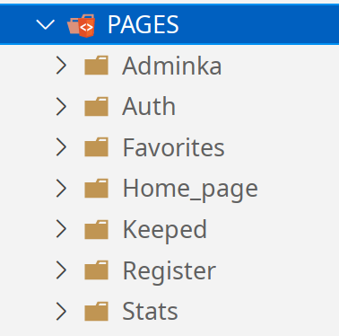

## Содержание

- [Содержание](#содержание)
- [Взаимодействие клиент-сервера](#взаимодействие-клиент-сервера)
- [Работа с JSON базой данных](#работа-с-json-базой-данных)
  - [Формат хранения данных в БД](#формат-хранения-данных-в-бд)
  - [Общение с БД](#общение-с-бд)
<!-- - [] -->

## Взаимодействие клиент-сервера
На Бэкенд стороне веб-прилжения реализованы эндпоинты (REST-API), описанные в файле `src/routes/RestApi.ts`

**Пройдемся по строкам:**

Средствами библиотеки [`express`](https://www.npmjs.com/package/express) создается роутер:
```ts
import { Router } from 'express' // импортируем роутер экспресса
```

Затем импортируются необходимые контроллеры.
\
В текущем примере - управляющие лайками(`Favorites_Controller`) и закладками (`Keep_Controller`)
```ts

import { FavoritesController } from '../app/controllers/favorites.controller'
import { KeepController } from '../app/controllers/keep.controller'

```

Создаем веб роутер
```ts
export const WEBrouter = Router()
```


Далее с помощью метода `post` присваиваем статический метод контроллера (2 аргумент метода) к rest api пути (1 аргумент метода)
```ts
// WEBrouter.post(1аргумент, 2аргумент) 👈️

//лайки
WEBrouter.post(REST_API('/favorites_api'), Favorites_Controller.perform)
WEBrouter.post(REST_API('/add_2_favorite'), Favorites_Controller.add2favorite)
WEBrouter.post(REST_API('/remove_from_favorite'), Favorites_Controller.remove_from_favorite)
WEBrouter.post(REST_API('/get_favorites_names'), Favorites_Controller.get_favorite_org_names)

//закладки
WEBrouter.post(REST_API('/keep_api'), Keep_Controller.perform)
WEBrouter.post(REST_API('/add2keep'), Keep_Controller.add2keep)
WEBrouter.post(REST_API('/remove_from_keep'), Keep_Controller.remove_from_keep)
WEBrouter.post(REST_API('/get_keeped_names'), Keep_Controller.get_keep_org_names)
```

На фронтенд части посылаем запрос на один из назначенных адресов и получаем подготовленные данные

## Работа с JSON базой данных

### Формат хранения данных в БД

JSON БД представляет собой дерево вложенных объектов:
```json
{
    "organizes": {
        "Фонд": {
            "info": "дополнительная информация", // дополнительная информаци
            "link1": "https://google.com", // ссылки
            "link2": "https://yandex.ru",
            "name": "Благофонд1", // название фонда
            "index": 2, // индекс фонда (не отображается в UI)
            "last_modify": "14/05/22 01:34:59", // дата последнего изменения
            "old_name": "Благофонд1", // предидущее имя фонда
            "favorite_counter": 3, // счетчик лайков
            "keep_counter": 2 // счетчик закладок
        },
        // ...
    },

    "users": { 
        "some_user": {
            "login": "some_user", // логин
            "password": "some_user", // пароль
            "user_type": "default", // тип пользователя
            "favorites": {
                "BB Фонд": "BB Фонд", // фонд добавленный в лайки
                // ...
            },
            "keep": {
                "BB Фонд": "BB Фонд" // фонд добавленный в закладки
                // ...
            }
        },
        // ...
    }
}
```

### Общение с БД
общение бэкенда с БЖ осуществляется методами реализованными в классе **JsonDB_Methods** (`src/app/services/jsondb.services.ts`)

Пример реализации метода получения закладок для текщего пользователя:

```ts
public static getOrganizes_favorite_counts = () => {
    const { jsondb } = JsonDB_Contract()
    const organizes = jsondb.getData(`/organizes`)
    const org_names = Object.keys(organizes)

    /**
     * получаем массив чисел - счетчик лайков для каждой организации
     */
    const favorite_count: number[] = org_names.map((org_name): number => {
        return jsondb.getData(`/organizes/${org_name}/favorite_counter`)
    })

    /**
     * end_pairs - содержит массив из пар значений - [имя_организации, ее счетчик лайков]
     */
    const end_pairs: (string | number)[][] = org_names.map((org_name, i) => {
        return [org_name, favorite_count[i]]
    })
    return { end_pairs }
}
```

Работа кода на стороне UI (React фреймворк)

Все страницы в веб-приложении размещены в отдельных папках:

<div style='text-align:center' >



</div>